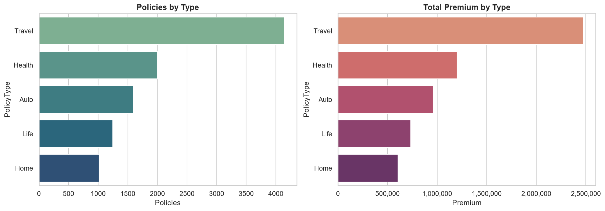
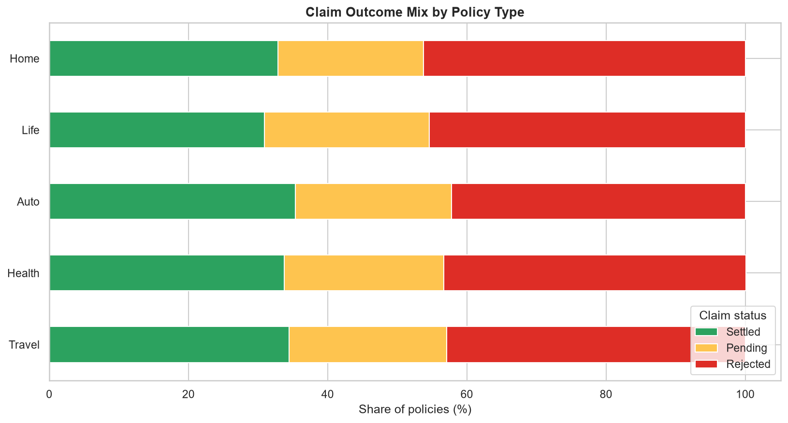
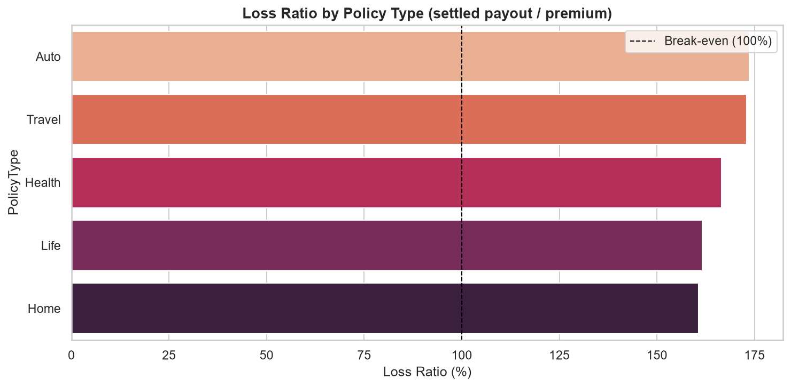
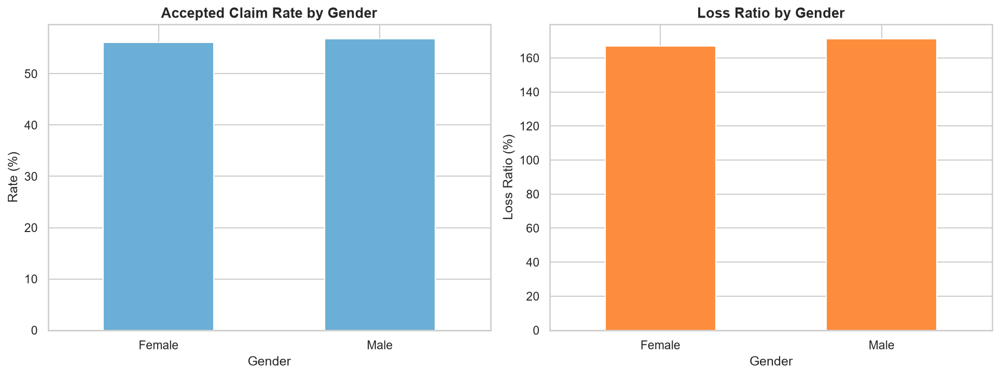
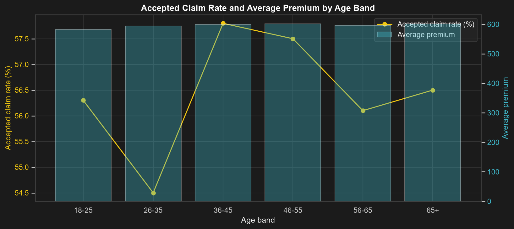
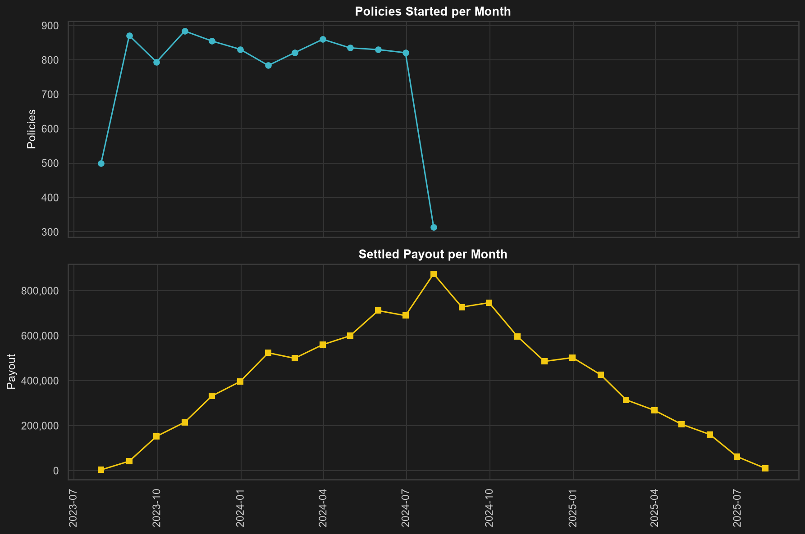
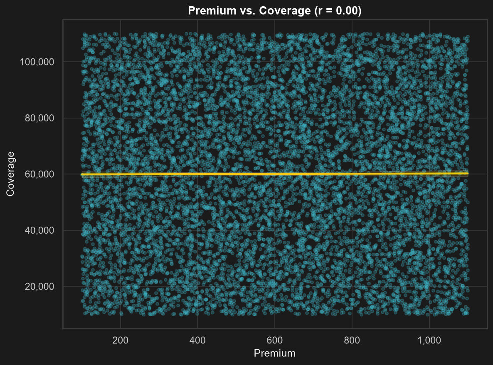
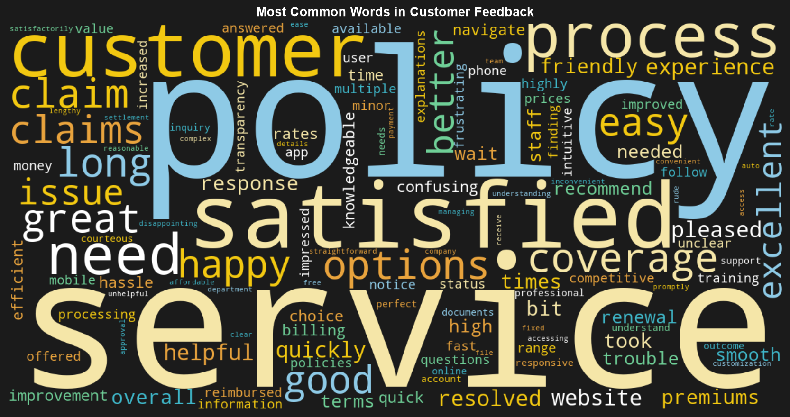
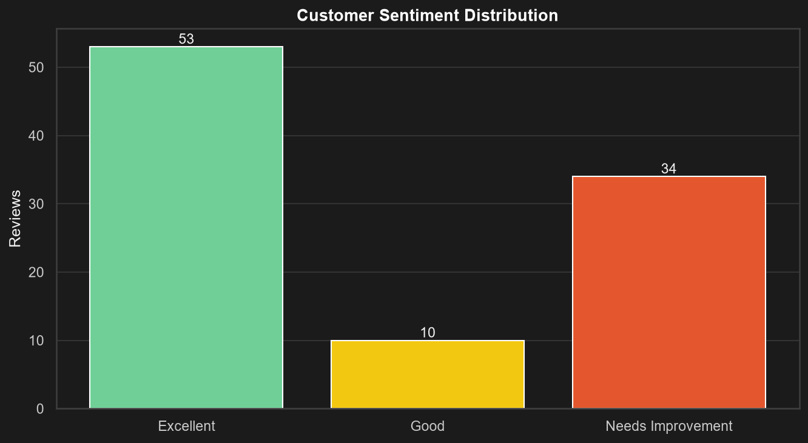
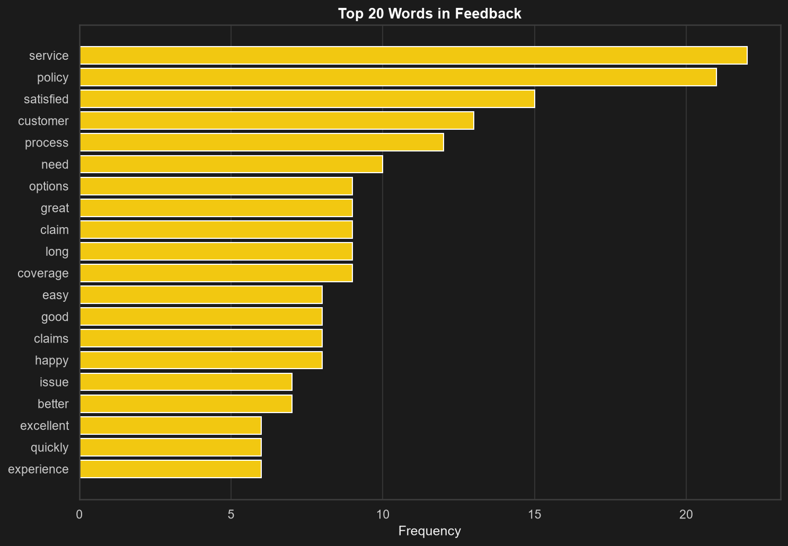

# 🛡️ Insurance Data Analysis

[](https://github.com/panteamkhh/insurance-data-analysis/actions/workflows/ci.yml)
[](LICENSE)
[](https://www.python.org/downloads/)
[](https://github.com/psf/black)

A synthetic insurance portfolio — **10,000 policies** across Travel, Health,
Auto, Life and Home — analyzed question by question in **Python**. Each answer
is produced by a reusable, tested function, so the whole report regenerates
from raw data with a single command.

The analysis focuses on the questions an insurer actually asks: how big is the
book, what happens to the claims that come in, which lines are loss-making, and
whether premium is priced in line with the cover being sold.

## Table of contents

- [Dataset](#dataset)
- [Analysis in Python](#analysis-in-python)
- [Power BI dashboard](#power-bi-dashboard)
- [Customer feedback sentiment](#customer-feedback-sentiment)
- [Key results](#key-results)
- [Tech stack](#tech-stack)
- [Project structure](#project-structure)
- [Quick start](#quick-start)
- [Development](#development)
- [Key assumptions](#key-assumptions)
- [License](#license)

## Dataset

`data/insurance_data.csv` is a **synthetic sample** insurance dataset used for
demonstration. Each of the 10,000 unique policies carries an embedded claim
record:

| Field | Description |
| --- | --- |
| `PolicyNumber`, `CustomerID` | Policy and customer identifiers |
| `Gender`, `Age` | Customer demographics |
| `PolicyType` | `Travel`, `Health`, `Auto`, `Life`, `Home` |
| `PolicyStartDate`, `PolicyEndDate` | One-year policy window (`DD-MM-YYYY`) |
| `PremiumAmount` | Premium the customer pays |
| `CoverageAmount` | Maximum the policy pays out |
| `ClaimNumber`, `ClaimDate`, `ClaimAmount` | Claim filed against the policy |
| `ClaimStatus` | `Settled`, `Pending` or `Rejected` |

> The data is synthetic and the identifiers are not real people. Amounts are
> unit-less (no currency is implied).

## Analysis in Python

The notebook answers one question at a time and lets each answer raise the next.
Every chart below is exported to [`screenshots/`](screenshots) by the CLI and
rendered inline in
[`notebooks/Insurance_Data_Analysis.ipynb`](notebooks/Insurance_Data_Analysis.ipynb).

**How is the book composed?**
Travel dominates volume with ~41% of all policies, but premium is spread far
more evenly across products — average premium barely moves between lines.

<p align="center"></p>

**What happens to the claims that are filed?**
The outcome mix is remarkably consistent across lines: roughly a third settle,
a fifth stay pending and the remainder are rejected. Rejections are the single
biggest driver of the loss ratio below.

<p align="center"></p>

**Which lines actually make money?**
The **loss ratio** compares settled payouts with premium collected. A line above
100% pays out more than it takes in — and every single line is above 100%.

<p align="center"></p>

**Do demographics matter?**
Premium and claim frequency are almost identical for men and women, and the
accepted-claim rate only shifts a few points across age bands. Together with the
loss-ratio picture, the implication is that this book is not risk-rated.

<p align="center">
  
  
</p>

**How does the book move over time?**
Policies are written steadily through the year, while the settled-payout curve
lags originations by roughly six months — the median time between a policy
starting and a claim being filed is 183 days.

<p align="center"></p>

**Is coverage priced in line with premium?**
Coverage and premium are effectively **uncorrelated** (r ≈ 0.003): a customer
paying more does not buy proportionally more cover. That is a clear signal that
pricing is not tied to the exposure being underwritten.

<p align="center"></p>

Every step above is a function in [`src/`](src) — `analysis.py` returns the
numbers and `visualization.py` renders the chart — so the notebook re-runs
end-to-end on fresh data with no manual steps. Intermediate, premium/coverage,
status-mix and claim-severity charts are in [`screenshots/`](screenshots).

## Power BI dashboard

The same portfolio is packaged as an interactive Power BI report
([`powerbi/insurance-dashboard.pbix`](powerbi/insurance-dashboard.pbix)) so
non-technical stakeholders can explore it without touching Python. It reads the
raw CSV at [`data/insurance_data.csv`](data/insurance_data.csv) and drives the
headline numbers from slicers.

<p align="center"></p>

- **KPI cards** — premium (5.98M), coverage (600.55M) and claim amount (16.91M).
- **Premium by policy type** — Travel leads, matching the Python analysis.
- **Active vs. inactive policies** — 74.9% inactive, 25.1% active.
- **Claims by status** — rejected / settled / pending funnel.
- **Claim amount by age group** and a **policy-type matrix** of claim outcomes
  by status.

> The dashboard is built directly on the raw file, so its totals include the
> few duplicate rows that the Python pipeline removes — hence the small
> differences (e.g. 5.98M vs. 5.97M premium). The Python package remains the
> source of truth for the numbers. See [`powerbi/README.md`](powerbi/README.md)
> for details.

## Customer feedback sentiment

The 97 free-text customer reviews are scored and labelled with a machine
learning pipeline. A pretrained transformer labels the reviews (the "teacher"),
and a lightweight TF-IDF + linear model is distilled from it so the analysis
runs without a deep-learning stack — **~90% agreement and 0.86 macro F1** on
5-fold cross-validation. Full write-up in
[`docs/sentiment_methodology.md`](docs/sentiment_methodology.md).

<p align="center"></p>

<p align="center">
  
  
</p>

- **~55% Excellent, ~10% Good and ~35% Needs Improvement.**
- Happy customers talk about **fast, helpful, friendly service**; unhappy ones
  about **wait times, confusing policy options and slow claims**.
- Three interchangeable scorers (distilled sklearn model, transformer, VADER)
  share one interface; the notebook
  [`Customer_Feedback_Sentiment.ipynb`](notebooks/Customer_Feedback_Sentiment.ipynb)
  walks through scoring, labelling and the word clouds.
- Run it with `python -m src.run_feedback_analysis`.

## Key results

- **10,000 unique policies** (from 10,004 raw rows, after dropping duplicates)
  and **10,000 customers**.
- **$5.97M in premium** against **$10.11M in settled payouts** — an overall
  **loss ratio of 169%**. Every product line is unprofitable
  (Auto 174%, Travel 173%, Health 167%, Life 162%, Home 161%).
- **43% of claims are rejected**, 34% settle and 23% remain pending. A further
  $6.80M of pending claims is not yet in the loss ratio.
- **Premium and coverage are uncorrelated** (Pearson r = 0.003), so cover is not
  priced proportionally to exposure.
- **Demographics are neutral**: gender and age move claim frequency and loss
  ratio by only a few percentage points.

## Tech stack

**Python** — pandas, numpy, matplotlib, seaborn, Jupyter
**Machine learning** — scikit-learn (TF-IDF + linear models), a distilled
sentiment classifier, and an optional Hugging Face transformer teacher
**Power BI** — interactive report with slicers, KPI cards and a claim matrix
**Tooling** — pytest, ruff, black, pre-commit, GitHub Actions

## Project structure

```
insurance-data-analysis/
├── data/
│   ├── insurance_data.csv          # source policy + claim data
│   └── customer_feedback.csv       # 97 customer reviews
├── docs/
│   ├── data_dictionary.md          # column reference and business rules
│   ├── sentiment_methodology.md    # how the sentiment model is built
│   └── original_column_notes.docx  # original (Persian) column notes
├── models/
│   ├── sentiment_model.joblib      # distilled sentiment classifier
│   └── sentiment_metrics.json      # cross-validation results
├── notebooks/
│   ├── Insurance_Data_Analysis.ipynb
│   └── Customer_Feedback_Sentiment.ipynb
├── powerbi/                        # interactive dashboard (work in progress)
│   ├── insurance-dashboard.pbix
│   └── screenshots/
├── src/                            # analysis package
│   ├── config.py                   # project paths and constants
│   ├── theme.py                    # shared dark chart theme
│   ├── data_loader.py              # reads + validates the raw CSVs
│   ├── data_cleaning.py            # de-duplication, dates, validation
│   ├── feature_engineering.py      # age bands, claim lag, loss ratios
│   ├── analysis.py                 # one function per business question
│   ├── visualization.py            # matching chart for each question
│   ├── run_analysis.py             # claims analysis CLI entry point
│   ├── text_preprocessing.py       # tokenising and stop words
│   ├── sentiment.py                # three scorers + score-to-label mapping
│   ├── train_sentiment.py          # distillation and model selection
│   ├── word_analysis.py            # word frequencies and word clouds
│   ├── feedback_visualization.py   # sentiment charts
│   └── run_feedback_analysis.py    # feedback CLI entry point
├── tests/                          # pytest suite
├── screenshots/                    # chart images exported by the CLIs
├── output/                         # generated CSV exports (git-ignored)
├── pyproject.toml                  # metadata, deps, tool config
├── requirements.txt                # runtime dependencies
├── requirements-dev.txt            # runtime + dev dependencies
├── requirements-ml.txt             # optional transformer teacher deps
└── .github/workflows/ci.yml        # lint + format + test CI
```

## Quick start

```bash
git clone https://github.com/panteamkhh/insurance-data-analysis.git
cd insurance-data-analysis

python -m venv .venv
# Windows (PowerShell)
.\.venv\Scripts\Activate.ps1
# macOS / Linux
source .venv/bin/activate

pip install -r requirements.txt
```

Run the claims analysis and regenerate every chart and CSV export:

```bash
python -m src.run_analysis
```

Score the customer feedback and rebuild the word clouds:

```bash
python -m src.run_feedback_analysis
```

Explore the notebooks interactively:

```bash
pip install -r requirements-dev.txt
jupyter notebook notebooks/
```

## Development

```bash
pip install -e ".[dev]"   # or: pip install -r requirements-dev.txt

ruff check .              # lint
black --check .           # formatting
pytest                    # tests
pytest --cov=src          # tests with coverage
pre-commit install        # optional git hooks
```

CI runs lint, format checks and the test suite on Python 3.10–3.12. See
[`CONTRIBUTING.md`](CONTRIBUTING.md) for details.

## Key assumptions

- Policies are assumed to run for a full year; the data-confirmed duration is
  365–366 days.
- Rejected claims carry an amount of `0` and no claim date, so they are excluded
  from payout and severity calculations but still counted in the outcome mix.
- The **loss ratio** is settled payout divided by total premium. Pending claims
  are reported separately and are not treated as paid.
- `HasValidClaim` groups settled and pending claims as "accepted or open", which
  is used for the claim-frequency figures.
- Amounts are unit-less; no currency conversion is applied.
- Sentiment labels are distilled from a pretrained transformer (weak labels), so
  the reported accuracy measures agreement with that teacher, not human ground
  truth. See [`docs/sentiment_methodology.md`](docs/sentiment_methodology.md).

## License

Released under the [MIT License](LICENSE).
